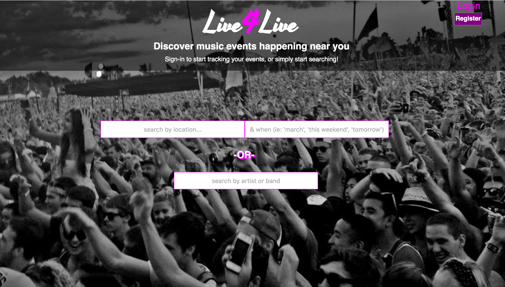

# Live4Live - an Event Finder

### Discover new (or old) music near you
#### See what events are happening locally or globally and preview songs by artists and bands you may not be familiar with. 

An application that allows a user to discover and (potentially) share live music events near wherever they may be around the world.  Without user authentication, you have the ability to search for events by either location (city name, zip code, etc.) AND when (by queries ranging from month name to 'tomorrow' or 'next weekend') or searching by artist/band, either of which will bring back a list of events that fit the search requirements.  You then have the ability to go thru the events and preview songs by artists with events coming up whom you may not be familiar with.  Simply use the search bar on top of the 'search-events' modal to bring up songs to preview (note that if the artist is not available on Spotify, the search will generate no results).  WITH user auth, you can register a new Live4Live account, have the same abilities to search for events as well as song previews, but then you are also able to add an event to your 'Saved Events', to begin tracking upcoming shows you're interested in.        

When searching for 'San Diego' and 'November'......

Not familiar with Cherub, let's give them a listen 

Love it!  Adding to my 'Saved Events' 

Still working on:  the ability to remove an event from your 'Saved Events', ability to share an event from 'Saved Events', being responsive/mobile friendly, sorting the events by date 

Tech used:
* HTML5
* CSS
* ES6
* ReactJS
* Node.js
* Express
* PostgreSQL
* Eventful API
* Spotify API
